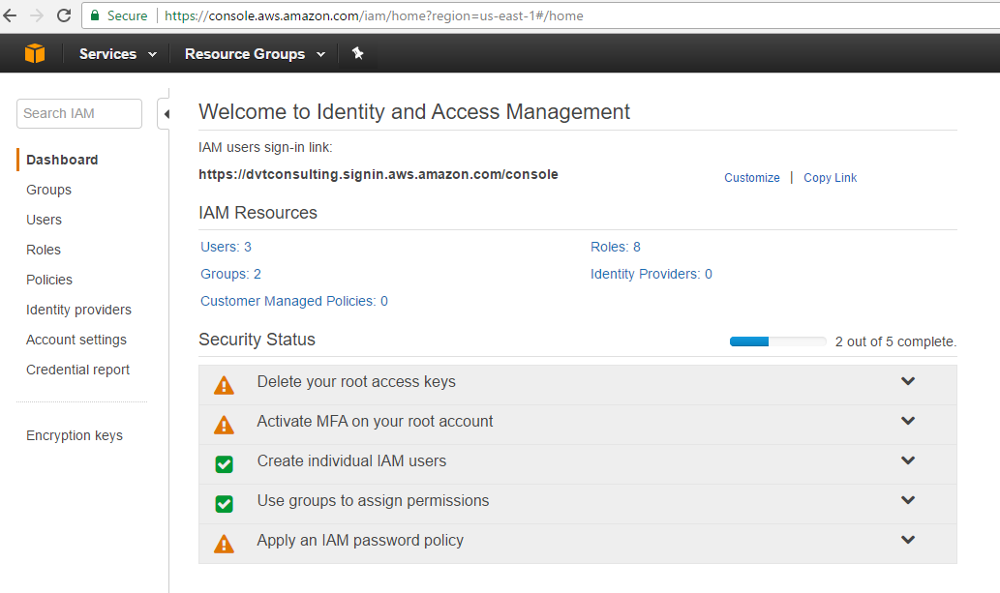
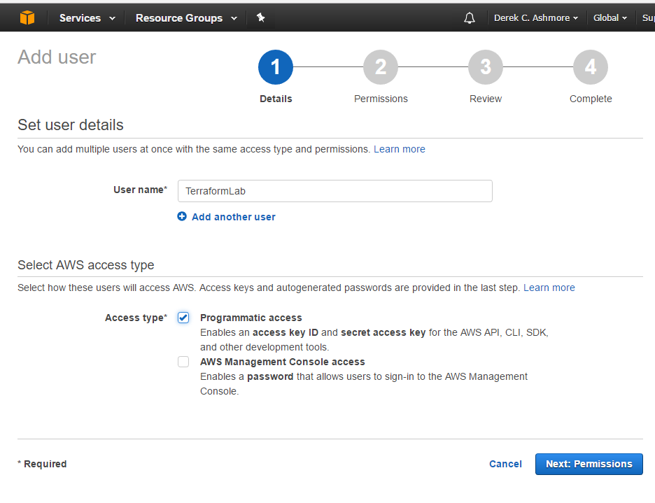
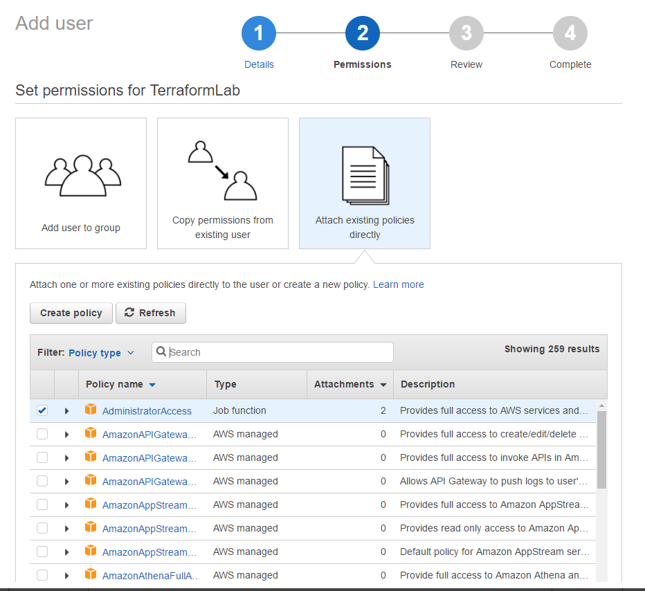
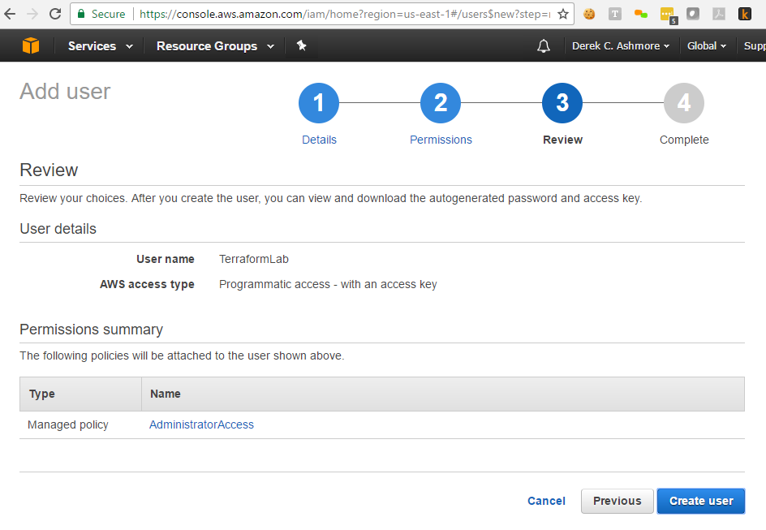
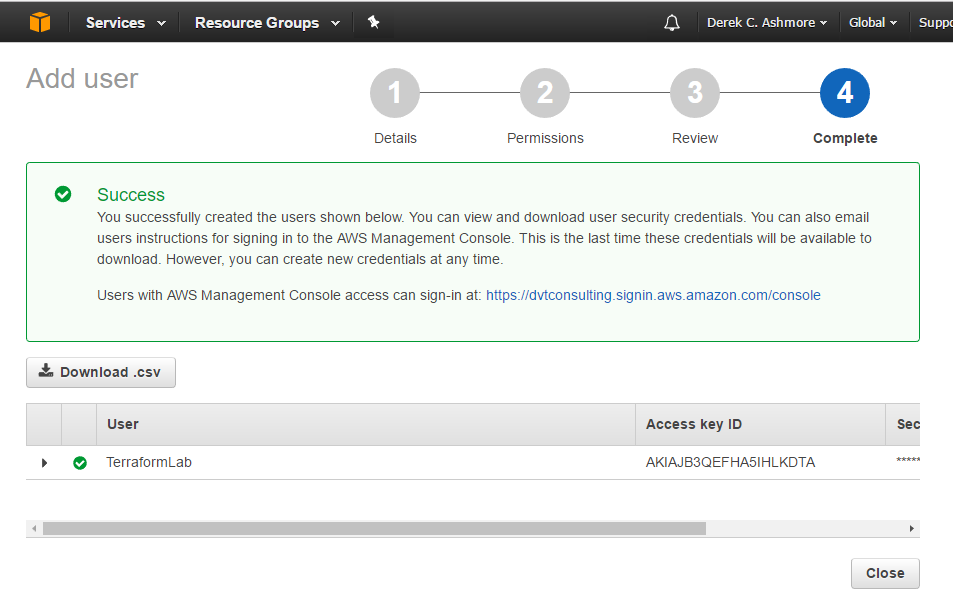

# Create AWS Administrator

This exercise creates a AWS user that's capable of executing remaining exercises.
This user will have only authority needed to execute the exercises and will not
have a log in.

> It's best practice for administrator users such as this to *not* have login
capabilities; they don't need them.

> It's also best practice for these ids to only have the authority they need and no more.

## Step 1: Log into the AWS Console.
* Sign into the [AWS Console](https://console.aws.amazon.com/console/home)
* Select the "Services" option in the upper left-hand corner
* Select "IAM" from the "Security, Identity & Compliance" section
* You *may* see a "Getting Started" page.  Click past it.

You should see a page like the page below.  Click "Users" on the left-hand side.


## Step 2: Add user "TerraformLab"
* Click "Add user" at the top and enter the name "TerraformLab"
* Check "Programmatic access" at the bottom and click "Next"


## Step 3: Add permissions for "TerraformLab"
* Click "Attach existing policies directly"
* Check the first option "Administrator Access" and click "Next"

> This lab really only needs ```AmazonVPCFullAccess``` and ```AmazonEC2FullAccess```.


## Step 4: Verify your User setup
Your "TerraformLab" user review page should look like the page below. If it doesn't,
select "Previous" and fix anything you need to.
* Click "Create User"


## Step 5: Download "TerraformLab" credentials
You will need your credentials for remaining exercises.  This is your *only* chance to download them.
> Do *not* maintain credentials in Git, SVN, or any other source control app *ever*!

